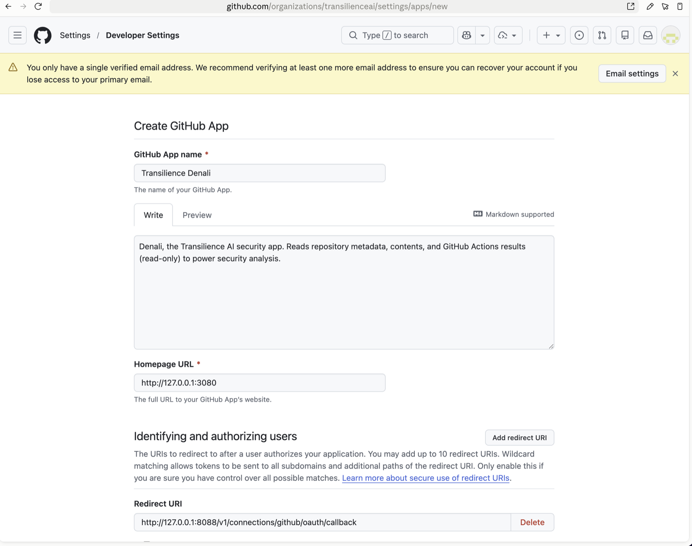
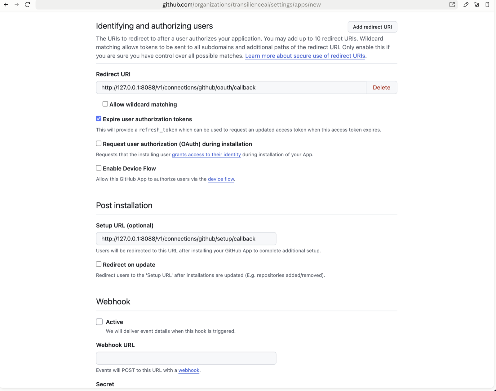
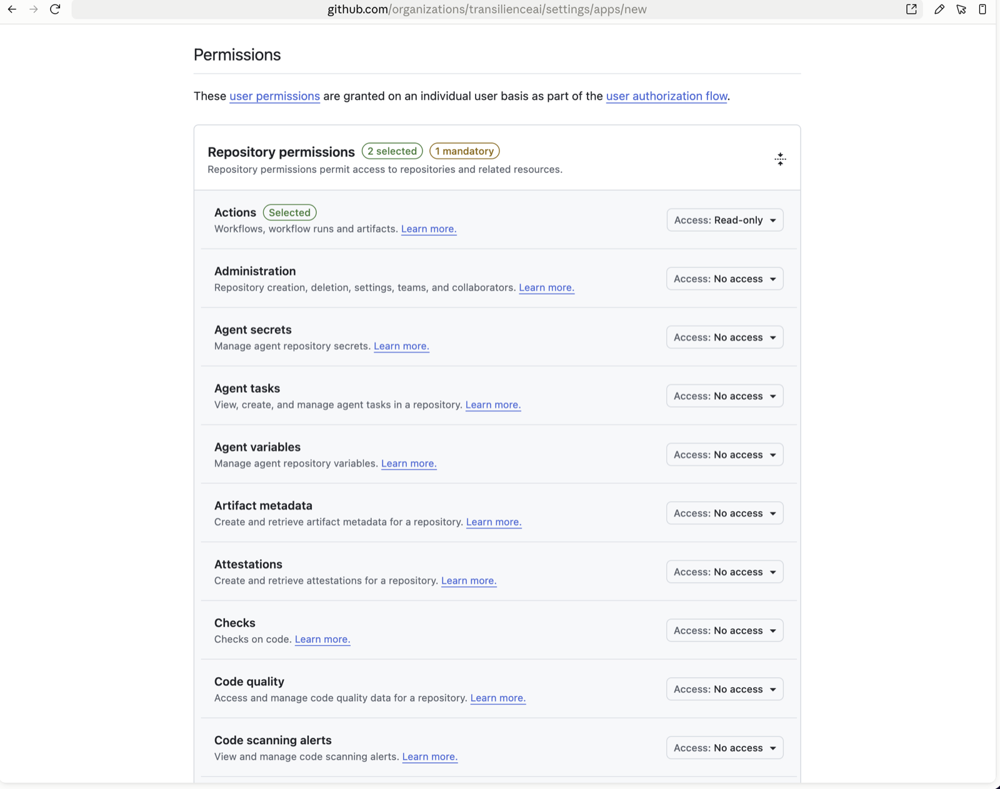
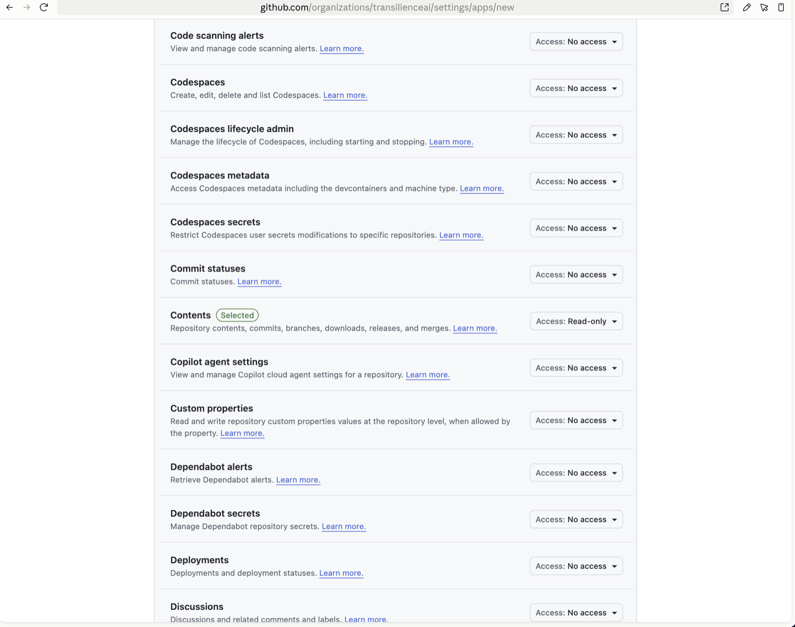
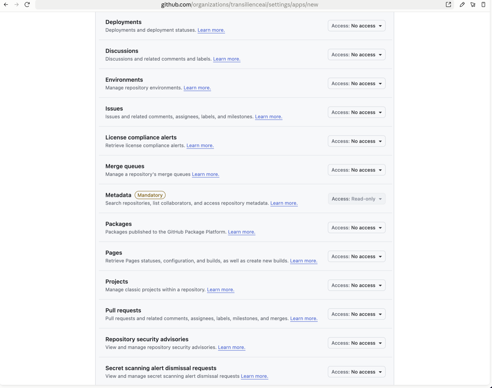
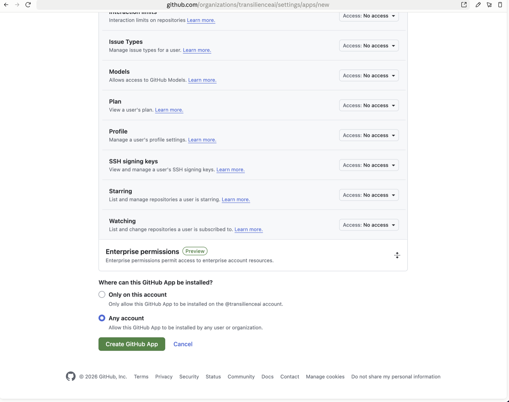
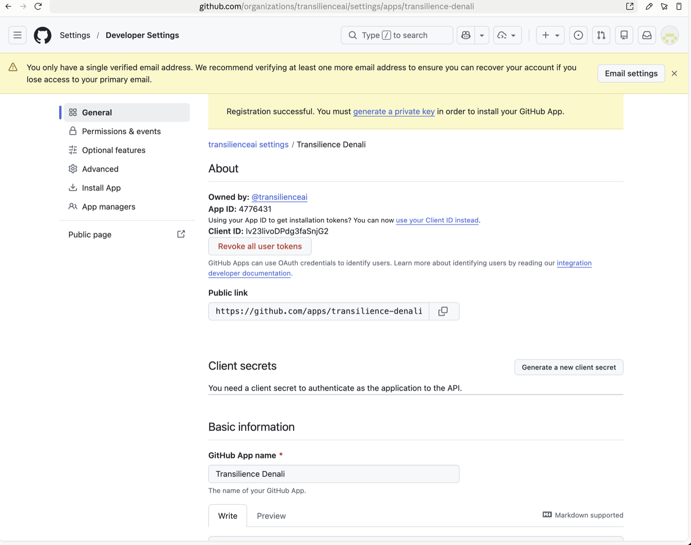

# GitHub App registration (`transilience-denali`)

Denali connects to customers' GitHub repositories through an organization-owned GitHub
App rather than anyone's personal login. Customers install the app on the repositories
they choose, and it receives only the read-only permissions the connector requires
(`src/denali/connections/github.py` enforces the same set at setup time). The API
authenticates as the app with the client secret and PEM private key.

The app was registered on 2026-08-30 at
`https://github.com/organizations/transilienceai/settings/apps/new` so it is owned by
the `transilienceai` organization, not an individual account.

## Registered values

| Setting | Value |
| --- | --- |
| Owner | `@transilienceai` |
| App name | Transilience Denali |
| App slug | `transilience-denali` |
| App ID | `4776431` |
| Public link | <https://github.com/apps/transilience-denali> |
| Homepage URL | `http://127.0.0.1:3080` |
| Callback URL | `http://127.0.0.1:8088/v1/connections/github/oauth/callback` |
| Setup URL | `http://127.0.0.1:8088/v1/connections/github/setup/callback` |
| Webhooks | Disabled |
| Request user authorization (OAuth) during installation | Disabled |
| Device flow | Disabled |
| Repository permissions | Metadata: read-only, Contents: read-only, Actions: read-only |
| Installation target | Any account |

The localhost URLs match the local Docker deployment. When Denali moves to its hosted
domain, edit Homepage, Callback, and Setup URLs on the app's settings page — nothing
needs to be re-registered.

## Screenshots

App identity and callback URL:



OAuth-during-installation disabled, setup URL, and webhook inactive:



Repository permissions — Actions, Contents, and Metadata are read-only; everything else
is "No access":







Installable by any account, so customers can install it on their own organizations:



Registration result with the App ID and Client ID:



## Remaining manual steps

On the app's settings page (`https://github.com/organizations/transilienceai/settings/apps/transilience-denali`):

1. Generate a client secret under **Client secrets** and store it in the team secret
   manager. It is shown only once.
2. Generate a private key under **Private keys**. GitHub downloads a `.pem` file; store
   it in the secret manager and place it on the API host outside the repository.

Never commit either value.

## API configuration

The API enables the GitHub connector only when all of these are set
(`_github_app_from_environment` in `src/denali/api/app.py`):

```bash
DENALI_GITHUB_APP_ID=4776431
DENALI_GITHUB_CLIENT_ID=Iv23livoDPdg3faSnjG2
DENALI_GITHUB_CLIENT_SECRET=REPLACE_ME
DENALI_GITHUB_APP_SLUG=transilience-denali
DENALI_GITHUB_PRIVATE_KEY_FILE=/path/to/transilience-denali.private-key.pem
# Optional; defaults to the local callback below.
DENALI_GITHUB_CALLBACK_URL=http://127.0.0.1:8088/v1/connections/github/oauth/callback
```

`DENALI_GITHUB_CALLBACK_URL` and the URLs registered on the app must stay in sync when
the deployment moves off localhost.
